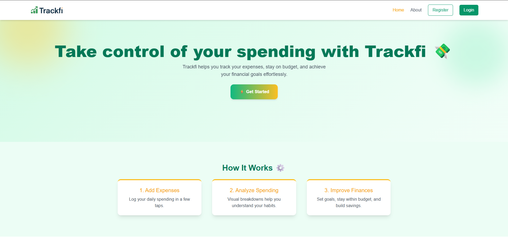
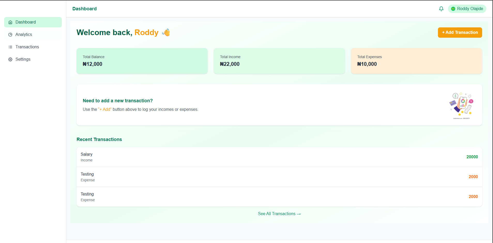

## 📊 TrackFi — Personal Finance Tracker

TrackFi is a modern and responsive personal finance tracker that helps users monitor their income and expenses, manage their profiles, and visualize spending patterns securely.

---

### 🚀 Features

* 🔐 **Authentication**: Register/Login with secure JWT-based auth
* 👤 **User Dashboard**: Personalized dashboard displaying transaction history and insights
* 🧮 **Income & Expense Tracking**: Categorize and manage financial transactions
* ⚙️ **Profile Management**: Update name and profile picture
* 🛡️ **Protected Routes**: Route protection for authenticated access only
* 📱 **Responsive Design**: Fully responsive and mobile-friendly layout
* 📦 **State management**: Rexux and Redux toolkit is used to manage state
* 📦 **LocalStorage Persistence**: User sessions are persisted across page reloads
* 📉 **Coming Soon**: Budget planner and charts

---

### 🛠️ Built With

* **Frontend**: React, Redux Toolkit, React Router, Tailwind CSS
* **Backend**: Node.js, Express, MongoDB, Mongoose
* **Authentication**: JWT-based authentication
* **UI Libraries**: Headless UI, React Spinners, React Icons
* **Charts and analytics**: Recharts
* **Other**: React toastify, loading states, and route guards

---

### 📦 Installation & Setup

> Clone the repo and install dependencies:

```bash
git clone https://github.com/Dev-Rodiyat/TrackFi.git
cd TrackFi
npm install
```

> Create `.env` file in root (sample below):

```env
VITE_BACKEND_URL=http://localhost:5000
```

> Start the development server:

```bash
npm run dev
```

---

### 📁 Folder Structure

```
src/
├── components/         # Reusable components (Navbar, Sidebar, etc.)
├── pages/              # Route pages (Dashboard, Login, etc.)
├── redux/              # Redux slices & store config
├── layout/             # Dashboard layout and scrol to top
├── utils/              # Helper functions (api, url)
├── assets/             # Images and static assets
└── App.jsx             # Main application routes
```

---

### 🔐 Protected Routes

Implemented using a `ProtectedRoute` component that checks if the user is authenticated. If not, it redirects to the login page.

```jsx
<Route element={<ProtectedRoute />}>
  <Route path="/dashboard" element={<Dashboard />} />
</Route>
```

---

### 💡 Future Improvements

* Budget planner and spending limits
* Pie and bar charts for financial insights
* Multi-currency support
* Email verification and password reset
* Firebase/Google OAuth login

---

### 📸 Screenshots

 

---

### 🙋‍♂️ Author

**\[Rodiyat Olajide]**
[GitHub](https://github.com/Dev_Rodiyat) | [LinkedIn](https://www.linkedin.com/in/rodiyat-olajide-71b737329/) | [X](https://x.com/Dev_Rodiyat)
